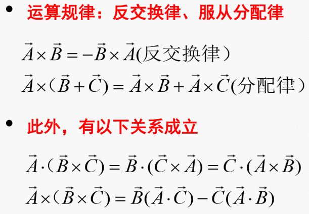

# 电磁场与电磁波笔记
# 目录
>   * [1.矢量与场论](#1)
>      * [1.1正交坐标系与矢量](#11)
>      * [1.2正交坐标系与矢量](#12)
<h2 id=1> 1.矢量与场论</h2>

>* [1.1正交坐标系与矢量](#11)
>* [1.2正交坐标系与矢量](#12)
<h3 id=11>1.1正交坐标系与矢量</h3>

#### 矢量
>1. **表示**： 用  $\vec{A}=A_x\hat{a_x}+A_y\hat{a_y}>+A_y\hat{a_y}$ 来表示
>2. **叉乘**
>$\vec{A}\times\vec{B}= \begin{array}{|ccccc|}
>   \hat{a}_x & \hat{a}_y & \hat{a}_z\\
>   \hat{A}_x & \hat{A}_y & \hat{A}_z\\
>   \hat{B}_x & \hat{B}_y & \hat{B}_z
>  \end{array} $ 
> 方向是右手$\vec{A}$扫向$\vec{B}$
>3. **运算规律**: **反交轮换平方差**
>     
>4. **点乘**：满足分配律和交换律  
#### 正交曲线坐标系
>1. **单位矢量**：曲线切向量指向增加一侧
>2. **弧微分和拉梅系数**
>拉梅系数: $H_i=±\sqrt {(\frac{\partial{x}}{\partial{q_i}})^2+(\frac{\partial{y}}{\partial{q_i}})^2+(\frac{\partial{z}}{\partial{q_i}})^2}$
>则 $ds_i=H_idq_i$ 面积元体积元看着办
>注意：ds_i理解为i变量引起的线长度变化
>3. **坐标系弧微分**
>* 柱坐标
$dl_r=dr$
$dl_\phi=rd_\phi$
$dl_r=dz$
>* 球坐标系
$
    \begin{cases}
        dl_R=dR &\\
        dl_\theta=Rd\theta\\
        dl_R=Rsin(\theta)d\phi
    \end{cases}
$
>4. **矢量函数**：
>* 某点矢量与该点位置的关系,
>矢量是由该点为起点出来的一个向量，不一定>是单位的
>* 有点像$(\vec{x},\vec{y},\vec{z})和(x,y,z)$的关系
>* 常矢量&变矢量指的是方向，用空间图来理解，
>比如不同的点$a_x$都是x的一个绝对方向，但是$a_\theta$就不一定了