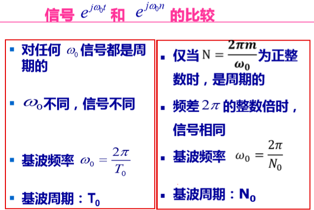
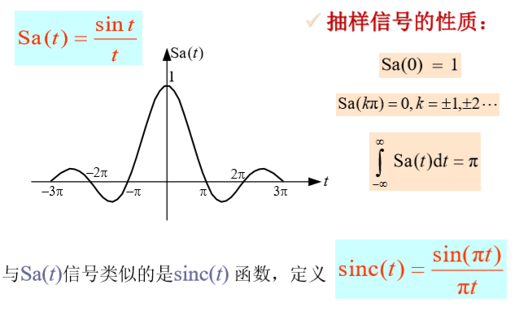
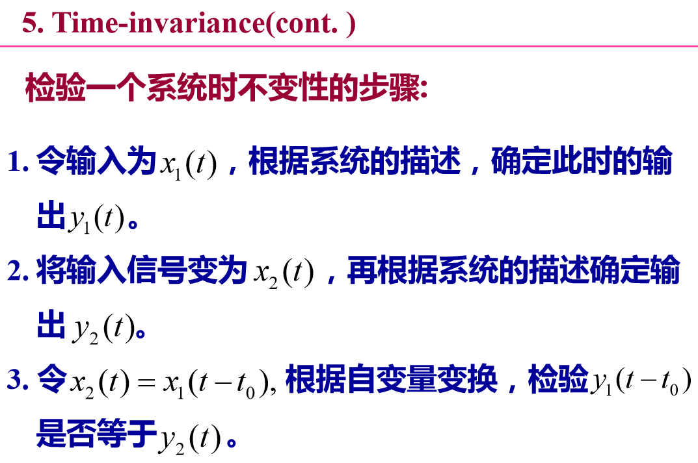
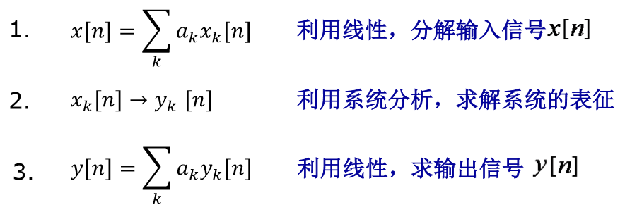
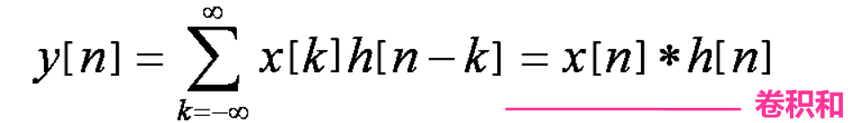

# 信号与系统
# 目录
>   * [1.信号与系统](#1)
>      * [1.1信号的描述和分类](#11)
>      * [1.2信号自变量的变换](#12)
>      * [1.3典型信号](#13)
>      * [1.4连续时间和离散时间系统](#14)
>   * [2.线性时不变系统](#2)
>      * [2.1信号分解](#21)
>      * [2.2LTI系统](#22)
>
## <w id=1> 1.信号与系统</h2>
>* [1.1信号的描述和分类](#11)
>* [1.2信号自变量的变换](#12)
>* [1.3典型信号](#13)
>* [1.4连续时间和离散时间系统](#14)
### <w id=11>1.1信号的描述和分类</h3>
<h4>  能量信号和功率信号</h4> 

>1. **能量**： 
>    * $E=\int_{t_1}^{t_2}{|x(t)|}^2dt$
>    * $E=\frac{1}{n_2-n_1+1}\displaystyle\sum^{n_2}_{n=n_1}{|x[n]|}^2$
>2. **功率**
>    * $P=\frac{1}{t_2-t_1} \int_{t_1}^{t_2}{|x(t)|}^2dt$
>    * $P=\frac{1}{t_2-t_1} \displaystyle\sum^{n_2}_{n=n_1}{|x[n]|}^2$
>* **无穷的情况t1=t2，n1=n2，N，T趋于$∞$**
>3. **能量信号**：能量有限，功率为0
>4. **功率信号**：能量无限，功率有限
### <w id=12>1.2自变量的三种基本变换
<h4>  时移反转尺度(抽取)</h4> 

>1. **尺度变换**x(t)->x(at)
>    * a>1是压缩a倍
>    * a<1是扩展1/a倍
>2. **抽取**x(n)->x(an)在原序列中每隔a-1个点抽一个点
>3. **变换顺序**：平移->展缩->翻转
### <w id=13>1.3典型信号
>1. **信号比较**
>  
>    * $\omega_0有Π的基本基本上都是周期函数$
>2. **离散单位冲激和单位阶跃信号**
>    *  $\delta[n]=u[n]-u[n-1]$一次差分关系
>    * $u[n]=\displaystyle\sum^n_{k={-\infty}}\delta[k]=\displaystyle\sum_{k=0}^{\infty}\delta[n-k]$
>    * 第一个式子是所有值的叠加，第二个式子是多个式子的叠加，本质上都是±$∞$都行的
>**单位阶跃**：界定一个自变量的取值范围
>3. **连续的单位冲击和阶跃**
>    * 求导和积分的关系
>    * $\delta(t)=\frac{du(t)}{dt}$
>    * $u(t)=\int^t_{-\infty}\delta(\tau)d{\tau}$
>    * 定义$\delta(t)$是一个面积为1的$\Delta t->0$的矩形脉冲
<h4>  抽样函数（Sa函数）</h4> 

>1. **描述**
>  
>2. **积分=Π**且Sa(0)=1
### <w id=14>1.4连续时间和离散时间系统</h3>
<h4>  系统及性质 </h4> 

>1. **输入-->系统-->输出**
>1. **连续时间系统**
>    * 输入输出都是连续时间信号
>    * x(t)->y(t)
>2. **离散时间系统**
>    * 输入输出都是离散时间信号
>    * x(n)->y(n)
>3. **系统分析的基本思想**：
>     1. 根据工程实际应用，对系统建立数学模型。 通常表现为描述输入－输>出关系的方程。 
>     2. 建立求解这些数学模型的方法。 
>     3. 要求系统有
>        * 可行性：具有可以对行为左除透彻描述的性质和结构，能建立有效>分析方法
>        * 普遍性：实际工程的系统很多都能用这类系统方法建模
>     4. 本课程研究LTI系统，线性时不变性系统   
>1. **系统的互联**
>    1. 级联
>    2. 并联:系统输出是两个系统的和
>    3. 反馈联结
<h4>  基本系统性质</h4> 

>1. **无记忆系统**：系统在n时刻的输出只与n时刻输入有关，和t时刻无关
>可逆：输出和输出是一一对应的
>2. **不可逆**：输出和输出不是一一对应的，可能一对多多对一
>    * 可逆系统是一对儿的，级联变成恒等系统y(t)是输出，x(t)是输入
>    * 积分和微分不是可逆的
>3. **因果性**：n时刻的输出之和n时刻和之前的输入有关
>4. **稳定性**：输入有界->输出有界
>5. **时不变性的判断**：
> 
>6. **线性**
>    * 可加性：$x_1(t)+x_2(t)\to y_1(t)+y_2(t)$
>    * 比例性：$Kx_1(t)\to Ky_1(t)$
>    * 微积分都是线性的
>    * 带常数项目的，取虚实部的都是非线性的
>    * 可以让一些输入信号分解输入获得输出在累加（Fourier）

## <w id=2> 2.线性时不变系统</h2>
>* [2.1信号分解](#21)
>* [2.2LTI系统](#22)
### <w id=21> 2.1 信号分解
<h4> 一些信号分解思路</h4>

>1. **直流分量和交流分量**
>直流平均值，交直流和为总信号
>2. **奇分量和偶分量**
>详情参考一个函数分解成奇偶函数之和，反转求和除二得偶，反转做差除二得奇
>3. **实部和虚部**
>共轭相加除以2得实，共轭相减除以2得虚
>4. **分解为01信号**
<h4> 信号分析是为了求解输入输出的关系</h4>

>1. **求解的过程**
>
>说明:这里的n指的是一组数据，同时也可以锁定为数组中的每一个输入对应的输出

### <w id=22>LTI系统
<h4>离散事件LTI系统</h4>

>1. $x[n]=\displaystyle\sum^\infty_{k=-\infty}x[k]\delta[n-k]$
>一串以为单位脉冲序列$\delta[n-k]d的线性组合$
>$x[k]是k处脉冲的权数字,\delta[n-k]是脉冲信号（序列）$
<h4>卷积和：离散时间LTI系统的单位脉冲响应</h4>

>1. $\delta[n]\to h[n]$单脉冲信号经过输出产生的输出信号序列h[n]
>2. **卷积和的计算**
>右边不是计算等效而是一个运算符号
>    * 图解法
>3. **卷积和的计算**
>以k为自变量x[k]不动，h[k]-->h[n-k],每一个k点的x[k]乘以一个h[n-k]序列，这里的翻转的含义可以理解为把对未来的影响延后了
>
>
>
>

