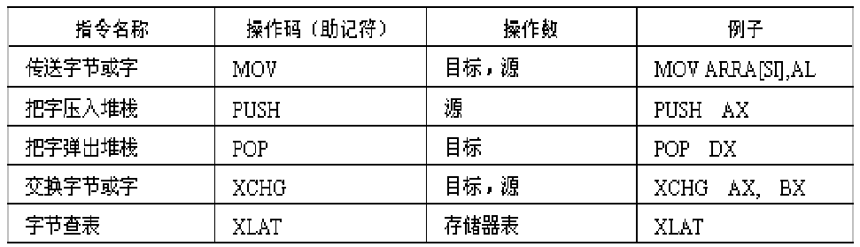

# 微机笔记
# 目录
>   * [1.8086的寻址方法和指令系统](#1)
>   * [2.8086的寻址方法和指令系统](#2)
>      * 1.1
>   * [3.8086的寻址方法和指令系统](#3)
>      * [3.1 8086寻址方式](#31)
>      * [3.2 8086寻址方式](#32)
<h2 id=1> 1.矢量与场论</h2>

>* [1.1正交坐标系与矢量](#11)
>* [1.2正交坐标系与矢量](#12)
<h2 id=3> 3.8086的寻址方法和指令系统</h2>

>* [3.1 8086寻址方式](#31)
>* [3.2 8086指令系统](#32)
### <w id=31>3.1 8086寻址方式
#### 四种寻址方式
>1. 立即数寻址
>2. 寄存器(直接)寻址
>3. 直接寻址
>4. 寄存器间接寻址
>5. 基址寻址
>6. 变址寻址
>7. （带位移的）基址变址寻址
### <w id=32>3.2 8086指令系统
#### 数据传送类 

>1. **堆栈操作数指令栈底是最高位**
>1. **SS和SP**
>    * **物理地址**=SS<<16到SS<<16+SP;
>    * **出栈sp++**
>    * **入栈sp--**
>    * **交换指令**  
>1. **交换指令**：段寄存器和立即数不能作为操作数
>4. **查表指令:** XLAT **表头变量名字**
>1. **LEA 目标寄存器,源操作数**
>[BX][SI]=[BX]+SI=SI[BX]
>2. **LED/LES 目标寄存器，源操作数**
>1. **LAHF** 读标志寄存器送到AH
>2. **LAHF** AH写入标志寄存器的低位
>3. **PUSHF**标志寄存器的内容推入对堆栈然后sp--
>4. **PUPF**取出堆栈顶内容然后sp--，标志寄存器的内容
>把目标操作数和源操作数互换
>不能同时为内存储单元
>段寄存器和立即数不能作为操作数
 I/O数据传送指令
>1. **IN 累加器（AX），端口号**
>2. **OUT 端口号，累加器（AX）**
>3. **端口号大于8位需要先move到DX再IN AX DX**
>4. **I/O端口编址方式**
>    1. 独立编址
>          * 优点：不占用内存地址，不减少存储器空间，I/O指令短，速度 快，能直接区分访问的是存储器还是外设，可读性好。 控制译 码电路简单。
>          * 缺点：只能对端口进行操作，不能进行其他运行处理。 
>    2. 统一编址
>          * 优点：系统结构简单，无需I/O专用指令，端口的寻址手段丰富，并 可进行相应的操作处理。 
>          * 缺点：程序的可读性差,且需要占用存储器的空间。
#### 算数运算指令
>1. **加法指令**
>    * ADD **目标**，**源**
>    源操作数+目标->目标
>    * ADC **目标**，**源**
>    源操作数+目标+CF->目标 CF是上一级的进位
>    * INC **目标** 累加，用于循环
>    源操作数+1->目标
>2. **减法指令** 
>    * SUB **目标操作数**，**源操作数**
>        * 目标-源操作数->目标
>        * 需要都是带符号或无符号，目标只能是寄存器或存储器，不能是立即数
>        * 补码无进位，表示有借位
>    * SBB **目标操作数**，**源操作数**
>        * 目标-源操作数-cf->目标 借位
>    * DEC **目标操作数**  自减
>    * NEG **目标操作数**  取反
>
>
>
>
>
>
>
>2. **加法指令**
>3. **加法指令**
>4. **加法指令**
>5. **加法指令**
>
>
>
>2. 算术运算类 
>3. 逻辑运算与移位指令 
>4. 字符串处理 
>5. 控制转移指令 
>6. 处理器控制指令

of=0有符号数溢出判断
cf=0无符号数溢出判断