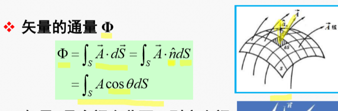

# 电磁场与电磁波笔记
# 目录
>   * [1.矢量与场论](#1)
>      * [1.1正交坐标系与矢量](#11)
>      * [1.2梯度与散度](#12)
>      * [1.3旋度](#13)
## <w id=1> 1.矢量与场论

>* [1.1正交坐标系与矢量](#11)
>* [1.2梯度与散度](#12)
>* [1.3旋度](#13)
### <w id=11>1.1正交坐标系与矢量

#### 矢量
>1. **表示**： 用  $\vec{A}=A_x\hat{a_x}+A_y\hat{a_y}>+A_y\hat{a_y}$ 来表示
>2. **叉乘**
>$\vec{A}\times\vec{B}= \begin{array}{|ccccc|}
>   \hat{a}_x & \hat{a}_y & \hat{a}_z\\
>   A_x & A_y & A_z\\
>   B_x & B_y & B_z
>  \end{array} $ 
> 方向是右手$\vec{A}$扫向$\vec{B}$
>3. **运算规律**: **反交轮换平方差**
>     
>4. **点乘**：满足分配律和交换律  
#### 正交曲线坐标系
>1. **单位矢量**：曲线切向量指向增加一侧
>2. **弧微分和拉梅系数**
>拉梅系数: $H_i=±\sqrt {(\frac{\partial{x}}{\partial{q_i}})^2+(\frac{\partial{y}}{\partial{q_i}})^2+(\frac{\partial{z}}{\partial{q_i}})^2}$
>则 $ds_i=H_idq_i$ 面积元体积元看着办
>注意：ds_i理解为i变量引起的线长度变化
>3. **坐标系弧微分**
>* 柱坐标
$dl_r=dr$
$dl_\phi=rd_\phi$
$dl_r=dz$
>* 球坐标系
$
    \begin{cases}
        dl_R=dR &\\
        dl_\theta=Rd\theta\\
        dl_R=Rsin(\theta)d\phi
    \end{cases}
$
>4. **矢量**：  
>       * 矢量函数：某点矢量与该点位置的关系,
>       矢量是由该点为起点出来的一个向量，不一定是单位的
>       * 单位矢量，就是一个表征方向的模长为1的矢量
>       * 有点像$(\vec{x},\vec{y},\vec{z})和(x,y,z)$ 的关系
>       * 常矢量&变矢量指的是方向，在绝对空间里面会不会变化
>       比如不同的点$a_x$都是x的一个绝对方向，但是$a_\theta$就不一定了

### <w id=12>1.2梯度与散度

####  标量场的梯度
>1. **场**：空间每点都对应物理量的一个确定值，则称在此空间确定了该量的一个场。
>2. **方向导数**$\frac{\partial{u}}{\partial{l}}|_{M_0}=\frac{\partial{u}}{\partial{x}}cos(\alpha)+\frac{\partial{u}}{\partial{y}}cos(\beta)+\frac{\partial{u}}{\partial{z}}cos(\gamma)$
>算偏导-->算余弦
>3. **梯度**：最大的方向导数记为gradu
>    * $\vec{G}=\hat{a_x}\frac{\partial{u}}{\partial{x}}+\hat{a_y}\frac{\partial{u}}{\partial{y}}+\hat{a_z}\frac{\partial{u}}{\partial{z}}$
$\vec{l}与\vec{g}$方向相同的时候方向导数最大,模最大为$gradu=|\vec{G}|$
>    * 哈密瓜算子 $
     \nabla=\vec{G}=\hat{a_x}\frac{\partial{}}{\partial{x}}+\hat{a_y}\frac{\partial{}}{\partial{y}}+\hat{a_z}\frac{\partial{}}{\partial{z}}$
>    * $gradu=\nabla u$ 其他坐标系注意微分变换就好 
>    底下的东西用弧微分变换公式，因为本来是对弧微分求导数的
>    * 因地制宜建立合理的坐标系

####  矢量场的散度

>1. **辨析矢量场，矢量线**   
>    * 矢量：空间里面的矢量，有方向，有大小
>    * 矢量场：一整个空间，每个坐标都有一个有方向的矢量
>    * 矢量线：一条和经过的每个点的矢量都相切的有向线段 
>2.  **绘制矢量线**
>    1. 先求出矢量的空间分布函数
>    2. 利用dl和空间分布函数同向的关系得到三个分量成比例转换为x，y，z的关系即可
>3. **矢量场的通量**
>    * 计算公式，其中cosθ是和法向量夹角，结果是个标量
>       
>4. **散度**
>    * $div\vec{A}=\displaystyle\lim_{x\to0}\frac{\int_s \vec{A}\cdot d\vec{S}}{\Delta V}$
>    * 定义为该通量源的能量密度，>0正源，<0负源，=0无源
>    * 用泰勒级数可以推出的一个散度公式 
>    * $div\vec{A}=\nabla\vec A$要注意和梯度辨析开来
>5. **高斯散度定理**
>    * 散度的体积分等于该物体的通量
>    * $\int_v{\nabla\cdot\vec{A}dV}=\int_s\vec{A}\cdot d\vec{S}$

### <w id=13>1.3旋度
#### 矢量场的旋度
>1. **环量**：矢量$\vec{A}$沿着闭合路径的线积分
>    * $\Gamma=\int_c \vec{A} \cdot d\vec l=\int_c Acos\theta dl$
>    * 反应该场在某回路上的漩涡特性
>    * 环量为0-->无漩涡源
>2. **环量面密度**:单位面积的环量
>3. **旋度**$rot\vec{A}$
>    * 最大的环量面密度，带方向
>    * 确定方向的环量面密度计算
>        $rot\vec{A}$=$\nabla ×\vec A$
>    * 沿着$\hat n$方向的环量面密度$rot\vec{A}・\hat n$
>
>4. **旋度和散度关系和性质**
>    |||||
>    |---|---|---|---|
>    |**环量**|**标量**|**矢量线积分**|$\int_c \vec A\vec{dl}=\int_c \vec A\cdot d\vec l=\int_s\nabla\times \vec A \cdot d\vec S$|
>    |**环量面密度**|**标量**|**单位面积矢量线积分**|$rot\vec{A}・\hat n$|
>    |**旋度**|**矢量**|**最大环量面密度**| $rot\vec{A}$=$\nabla ×\vec A$|
>    |**梯度**|**矢量**|**最大的方向导数**|$gradu$=$\nabla u$|
>    |**方向导数**|**标量**|**矢量大小**|$\hat n ・gradu$|
>    |**散度**|**标量**|**单位体积的矢量通量**| $\displaystyle\lim_{x\to0}\frac{\int_s \vec{A}\cdot d\vec{S}}{\Delta V}=div\vec{A}$|
>    |**通量**|**标量**|**矢量的面积分**|$\phi=\int_v{\nabla\cdot\vec{A}dV}=\int_s\vec{A}\cdot d\vec{S}$|

>5. **梯度的旋度为0，旋度的散度为0**
#### 斯托克斯定理  横向对比高斯散度定理 抵消证明
>1. **环量=旋度的面积分**
>2. **公式：**$\int_c \vec A\cdot d\vec l=\int_s\nabla\times \vec A \cdot d\vec S$
