# 通信电子线路 
# 目录
>   * [1.绪论](#1)
>      * [1.1无线电通信发展史](#11)
>      * [1.2无线电信号传输原理](#12)
>   * [2.选频网络](#2)
>      * [2.1串联谐振回路](#21)
>      * [2.2串联谐振回路](#22)
>      * [2.3串并联谐振回路等效互换和抽头时的阻抗变](#23)
>   * [3.选频网络](#3)
>      * [3.1晶体管高频小信号等效电路与参数](#31)
>      * [3.2单调谐回路谐振放大器](#32)
>      * [3.3多级单调谐回路谐振放大器](#33)
>      * [3.4谐振放大器稳定性](#34)
>      * [3.5放大器中的噪声](#35)
>   * [4.选频网络](#2)
>      * [2.1无线电通信发展史](#21)
>      * [2.2无线电信号传输原理](#22)
## <w id=1> 1.绪论</h2>
>* [1.1无线电通信发展史](#11)
>* [1.2无线电信号传输原理](#12)
### <w id=11>1.1无线电通信发展史</h3>
####  知识点1
>1. **别问问就是无线电nb**
### <w id=12>1.2无线电信号传输原理</h3>
####  信号传输流程
>1. **大流程**
>**信号源**$->$**发送设备**$->$**传输信道**$->$**接收设备**$->$**收信装置**
>2. **调频过程**
>

## <w id=2> 2.选频网络</h2>
>   * [2.选频网络](#2)
>      * [2.1串联谐振回路](#21)
>      * [2.2串联谐振回路](#22)
>      * [2.3串并联谐振回路等效互换和抽头时的阻抗变](#23)

### <w id=21>2.1串联谐振回路</h3>
#### 串联谐振
>1. **阻抗**$Z=R+jX=R+j(\omega L-\frac{1}{\omega C})$电抗=0阻抗最小**谐振**
>2. **品质因数** $Q=\frac {\omega L}{R}$针对电感而言的，几十到几百不等
>3. **回路品质因数**：谐振时才有的$Q=\frac {\omega_0 L}{R}=\frac{1}{\omega_0CR}$
>4. **谐振的电压**
>    * 电感：$\dot V_{L0}=\dot I_0j\omega_0L=jQ\dot V_s$
>    * 电容：$\dot V_{L0}=\dot -I_0J(\frac{1}{\omega_0C})=-jQ\dot V_s$
>    * 电感和电容两端电压模值大小相等等于外加电压的Q倍
>5. $\dot N(\omega)=\frac {R}{R+j(\omega L-\frac{1}{\omega C})}=\frac 1{1+jQ(\frac{\omega}{\omega_0}-\frac{\omega_0}{\omega})}$
>    * 幅度图
>   
>6. **广义失谐**
>$\delta=Q(\frac{\omega}{\omega_0}\!-\!\frac{\omega_0}{\omega})$
>$\omega约等于\omega_0时，\delta=Q\frac{2\Delta\omega}{\omega_0}=Q\frac{2\Delta f}{f_0}$
>7. **求解通频带用广义谐振** 求得$2\Delta\omega_{0.7}=\frac{\omega_0}{Q}$
>8. **相移** $\psi=-arctanQ\cdot(\frac{\omega}{\omega_0}-\frac{\omega_0}{\omega})$
>9. **能量关系**
>
>$W_c=W_l$
>$Q=2\pi\frac{回路储能}{每周期能耗}$
>10. **负载影响和内阻影响**
>$Q_L=\frac{Q_0}{1+\frac{R_s}{R}+\frac{R_L}{R}}$
>然后用Q去计算其他的东西
### <w id=22>2.2并联谐振回路
#### 一般时高Q的计算
>1. **导纳**
>    * $Y=G+jB=\frac{CR}{L}+j(\omega C-\frac{1}{\omega L})$
>    * 低感高容
>    * **谐振电纳=0阻抗最大时阻抗最大**
>2. $Q_p=\frac{\omega_pL}{R}=R_p\omega_pC$其中$R_p=\frac{1}{G}$
>    * $\dot I_{c_p}=jQ_p\dot I_s $
>    * $\dot I_{L_p}=-jQ_p\dot I_s $
>3. $\dot N(\omega)=\frac {R}{R+j(\omega C-\frac{1}{\omega L})}=\frac 1{1+jQ_p(\frac{\omega}{\omega_p}-\frac{\omega_p}{\omega})}$
>4. $Q_L=\frac{Q_p}{1+\frac{R_p}{R_s}+\frac{R_p}{R_L}}$

### <w id=23>2.3串并联谐振回路等效互换和抽头时的阻抗变换
#### 等效互换
>1. **如图所示可以推出来**
>
>其中$Q_{L2}=Q_{L1}$是两个回路的品质因数应该相等
>$RX_p是并联阻抗，RX_s是串联阻抗,$
#### 抽头式并联电路的阻抗变换
>2. **自耦合变压器**
>   * 由低抽头向高抽头转换时，等效阻抗提高$\frac{1}{p^2}$
>   * 由高抽头向低转换时，等效阻抗提高${p^2}$

## <w id=3> 3.选频网络
>* [3.1晶体管高频小信号等效电路与参数](#31)
>* [3.2单调谐回路谐振放大器](#32)
>* [3.3多级单调谐回路谐振放大器](#33)
>* [3.4谐振放大器稳定性](#34)
>* [3.5放大器中的噪声](#35)
### <w id=31>3.1晶体管高频小信号等效电路与参数
#### 形式等效电路(网络参数等效电路)
>1. **把晶体管看成二端口网络**
>$\dot I_1=y_i \dot V_1+y_r \dot V_2$
>$\dot I_2=y_f \dot V_1+y_o \dot V_2$
>
>三极管的形式等效电路
>
>$y_i$**：输入导纳**
>$y_r$**：反向传输导纳**return
>$y_f$**：正向传输导纳**front
>$y_o$**：输出导纳**
>
#### 混合$\pi$等效电路
>1. **等效电路图**
>
>各个元件宽频范围内都保持常数
>分析计算的时候很不方便
>2. **计算电路模型**
>
#### 晶体管高频参数
>1. 截止频率：$\dot \beta=\frac{\beta_0}{1+j\frac{f}{f_\beta}}下降到\frac{1}{\sqrt{2}}\beta的频率$
>2. 特征频率：$\beta=1$
>3. 最高工作频率$f_{max},功率增益G_p=1的时候$
>1. 截止频率
### <w id=32>3.2单调谐回路谐振放大器
#### 形式等效电路(网络参数等效电路)
>1. **单调谐：并联电路做负载**
>2. **静态分析**：电阻分压稳定电路
>3. **动态分析**：
>    1. 画交流等效电路
>
>       * 大电容短路
>       * 大电感短路
>       * 直流电源接地
>    2. 画交流小信号等效电路
>
>    3. 假定无反馈
>
>三极管没有电感的
>
>$y_{ie}=g_{ie1}+j\omega C_{ie1}$**三极管输入端输入导纳**
>$y_{oe}=g_{oe1}+j\omega C_{oe1}$**三极管输出端输出导纳**
>$Y_L=g_{ie2}+j\omega C_{ie2}$**电感输入端的输入导纳**
>
#### 电压增益
>1. **把晶体管集电极回路和负载 折合到振荡回路两端**
>
>受控源$y_{fe}V_{be}$的fe是此时频率，由于变压器变成$p_1$倍不过分
>$A_v=\frac{u_o}{u_i}=\frac{u_5}{u_i}=\frac{p_2u_{31}}{u_{be}}$
>2. **求出$u_{31}$即可求出$A_u$**
>3. $u_{31}=-\frac{p_1y_{fe}v_{be}}{g_{\sum}+j\omega C_{\sum}+\frac{1}{j\omega L}}$**电流除以电导嘛就是**
>4. $A_v=\frac{u_o}{u_i}=\frac{u_5}{u_i}=\frac{p_2u_{31}}{u_{be}}=-\frac{p_1p_2y_{fe}}{g_{\sum}+j\omega C_{\sum}+\frac{1}{j\omega L}}=-\frac{p_1p_2y_{fe}}{g_{\sum}(1+jQ_L\frac{2\Delta f}{f_0})}$**有一个广义失谐的代换**
#### 功率增益
>$G_{p0}=\frac{P_o}{P_i}（谐振时）$
>1. **谐振电压增益平方$\times$前后端输入之比**
>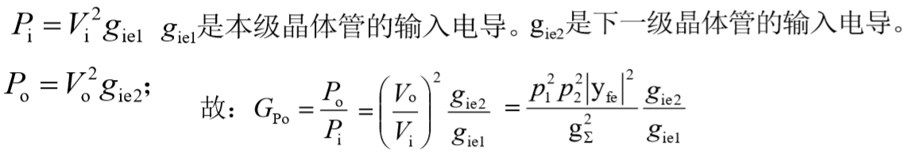
>传输匹配即上级输出导纳=下级输出导纳，此时输出功率最大
>${p_1}^2g_{oe1}={p_2}^2g_{ie2}$
>2. **如果传输匹配，回路自身元件无损**
>$g_p=0$
>则可以求出$(G_{p0})_{max}=\frac{{|y_{fe}|}^2}{4g_{ie1}g_{oe1}}$
>3. **如果传输匹配，回路自身元件有损**
>$g_p!=0$
>则可以求出$(G_{p0})'_{max}={(1-\frac{Q_L}{Q_0})}^2(G_{p0})_{max}=\frac{1}{k}(G_{p0})_{max}$
>其中$Q_0=\frac{1}{\omega_0Lg_p}$为空载Q
>其中$Q_L=\frac{1}{\omega_0Lg_{\sum}}$为有载Q
>$k=\frac{1}{{(1-\frac{Q_L}{Q_0})}^2}$为插入损耗
>
#### 通频带和选择性
>1. **通频带**
>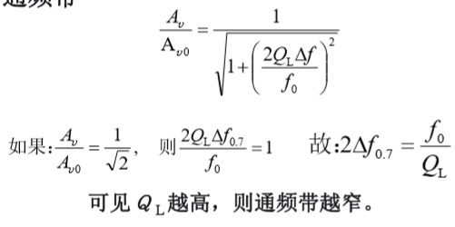
>2. **带宽积**
>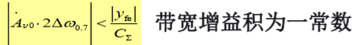
>其中$C_{sum}$是电容，$y_{fe}是受控源电纳$
>2. **选择性**：矩形系数越接近1越好，就直接是一个矩形
>$K_{r0.1}=\frac{2\Delta f_{0.1}}{2\Delta f_{0.7}}=\sqrt{{10}^2-1}>>1$不好，为常数
>过于平滑（0.1的带宽占0.7带宽的k倍，越1越好)
>3. **单调谐的增益带宽积，矩形系数都是常数**，带宽和增益是一对矛盾
### <w id=33>3.3多级单调谐回路谐振放大器
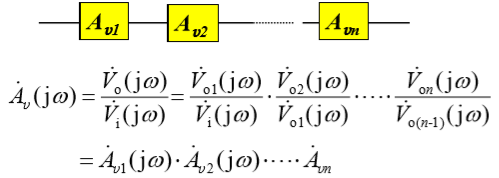 
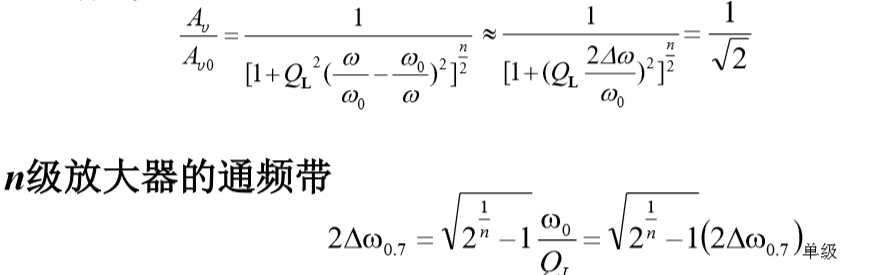 
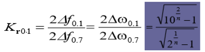 
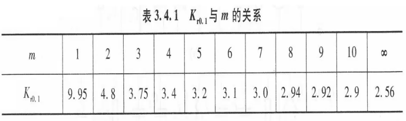 

>1. **前级输出为后级输入**
>1. **多级放大器=各级放大器增益乘积**
>3. **级数增加$\to$通频带还是会减小**
>1. **矩形系数**
>2. **会减少emmmm**：选择性有改善，无穷的时候极限慢慢趋于2.56，能力仍然有限
### 下面开始的讨论基本都是同电路级联

#### 利用双峰解决增益和通频带的茅盾，以及选择性的改善
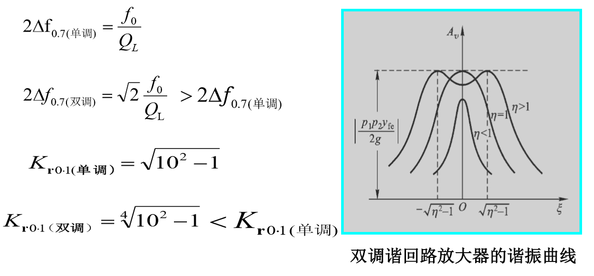

### <w id=34>3.4谐振放大器稳定性，讨论负反馈回路$Y_{re}!=0$
**以下讨论假定全部接入**

#### 输入导纳和输出导纳
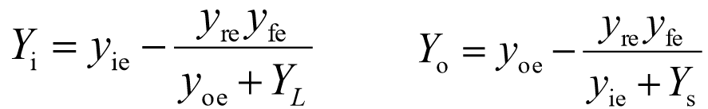 

>1. $Y_i|_{y_{re}=0}=y_ie$
>2. $Y_o|_{y_{re}=0}=y_oe$
>3. **变化是由考虑$y_{re}$造成的**

#### 自激产生的条件
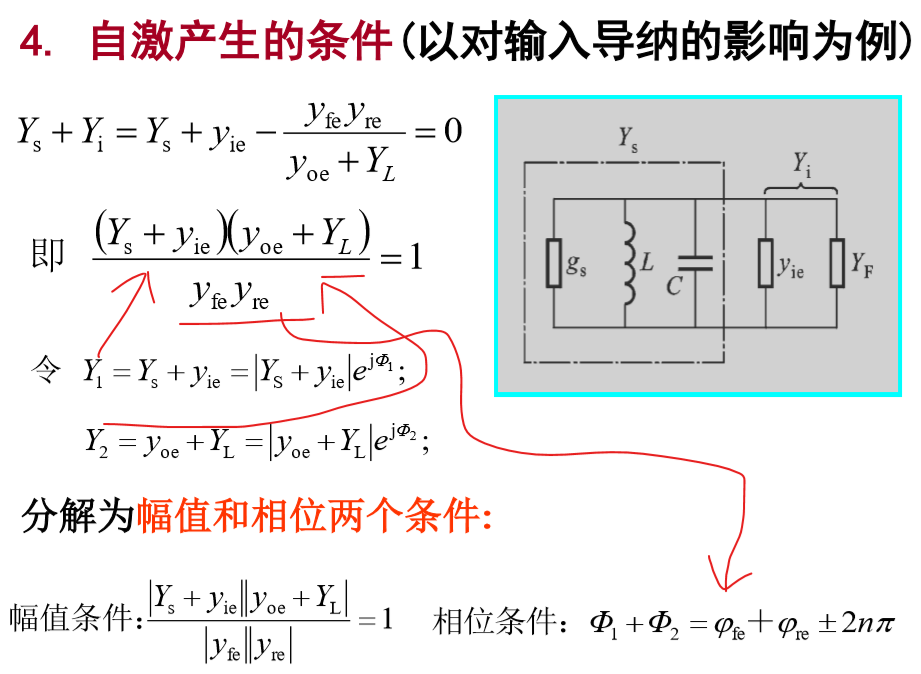

>1. 不损耗电源电压，输入端通过反馈自我供能
>g>0就不会自激了，起码有电源在参与
>2. **稳定系数大于1就是稳定的**
>让模值!=1就不会自激，否则若该相位刚好满足则可能自激，越大越稳定
>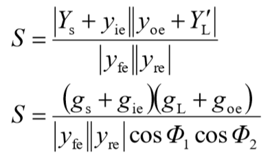
<h4>稳定性分析</h4>
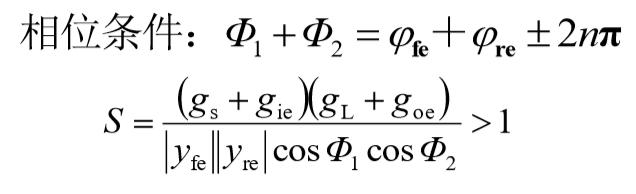

>1. **满足相位条件时让S>1**
>2. **假定输入输出回路相同电导为g电纳为Φ**
>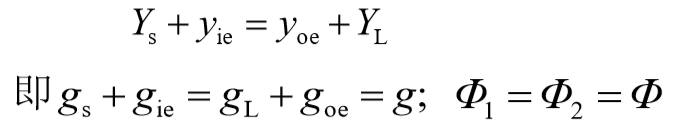
>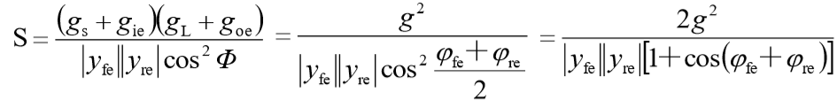
>2. **由于频率$f<<f_T,y_{fe}≈g_m,φ_{fe}≈0$**
>3. **由于频率$y_{re}≈-j\omega_0C_{re},φ=-90$是一个共射的**
>所以有$S=\frac{2g^2}{|y_{fe}|\omega_0C_{re}}$
>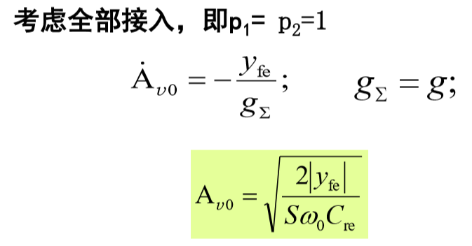
>4. 可知增益和稳定性是矛盾的，通常S取5~10
>
>5. **失配法**输入输出回路导纳和三极管回路不匹配
>典型电路，共射接共基，或者在回路并电阻加损耗（加g，则S++）
>

### <w id=35>3.5放大器中的噪声

<h4>噪声来源与特点</h4>

>1. 放大器的内部噪声主要是由电路中的电阻、谐振 回路和电子器件内部所具有的带电微粒无规则运动所 产生的
>2. 随机过程的特征通常用平均值，均方值，频谱和功率谱判断
<h4>电阻热噪声</h4>
<h4>天线热噪声</h4>
<h4>晶体管噪声</h4>
<h4>噪声系数</h4>

自己多了解把，应该不考笔记太多了

## <w id=4> 4.非线性电路，时变参量电路的和变频器</h2>

### <w id=41>4.1放大器中的噪声
>1. **分析方法：**
>   * 图解法：根据非线性元件的特性曲线和输入信号波 形，通过作图直接求出电路中的电流和电压波形。
>   * 分析法：借助于非线性元件特性曲线的数学表示式列 出电路方程，从而解得电路中的电流和电压。 
>2. **非线性电路展开后又平方，不满足叠加定理，会产生谐波分量**
>   * $v_0(t)=a_0+a_1v_i(t)+a_2v_i^2(t)$
>   * 基波分量：$\omega_1,2\omega_1,\omega_2,2\omega_1$
>   * 谐波分量：$\omega_1±\omega_2$

### <w id=42>4.3非线性分析方法
>1. **幂级数分析法**
>$i=f(v)=a_o+a_1v+a_2v^2+.....$
>
>$i=b_0+b_1(v-V_{02}+b_2(v-V_{02})^2)$
>一个工作点一个切线一个点带出二次方
>2. **折线分析法**
>
>
>   * 最大值和通角描述电流
>
### <w id=42>4.4线性事变参量分析法
>1. **时变跨导电路分析**
>2. **模拟乘法器：$Kv_1v_2$**
>3. **开关函数分析法**
>
>
>
>
>

