# 通信电子线路 
# 目录
>   * [1.绪论](#1)
>      * [1.1无线电通信发展史](#11)
>      * [1.2无线电信号传输原理](#12)
>   * [2.选频网络](#2)
>      * [2.1无线电通信发展史](#21)
>      * [2.2无线电信号传输原理](#22)
## <w id=1> 1.绪论</h2>
>* [1.1无线电通信发展史](#11)
>* [1.2无线电信号传输原理](#12)
### <w id=11>1.1无线电通信发展史</h3>
####  知识点1
>1. **别问问就是无线电nb**
### <w id=12>1.2无线电信号传输原理</h3>
####  信号传输流程
>1. **大流程**
>**信号源**$->$**发送设备**$->$**传输信道**$->$**接收设备**$->$**收信装置**
>2. **调频过程**
>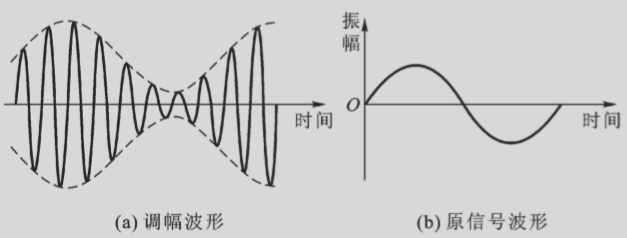

## <w id=2> 2.选频网络</h2>
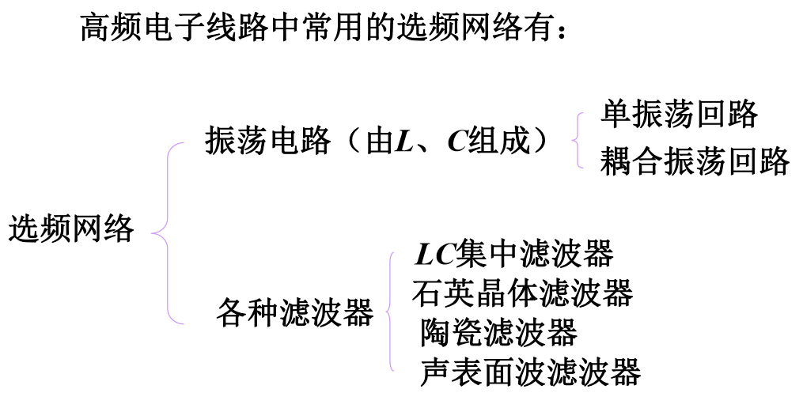

### <w id=21>2.1串联谐振回路</h3>
#### 串联谐振
>1. **阻抗**$Z=R+jX=R+j(\omega L-\frac{1}{\omega C})$
>2. **品质因数** $Q=\frac {\omega L}{R}$针对电感而言的，几十到几百不等
>3. **回路品质因数**：谐振时才有的$Q=\frac {\omega_0 L}{R}=\frac{1}{\omega_0CR}$
>4. **谐振的电压**
>   * 电感：$\dot V_{L0}=\dot I_0j\omega_0L=jQ\dot V_s$
>   * 电容：$\dot V_{L0}=\dot -I_0J(\frac{1}{\omega_0C})=-jQ\dot V_s$
>   * 电感和电容两端电压模值大小相等等于外加电压的Q倍
>5. $\dot N(\omega)=\frac {R}{R+j(\omega L-\frac{1}{\omega C})}=\frac 1{1+jQ(\frac{\omega}{\omega_0}-\frac{\omega_0}{\omega})}$
>   * 幅度图
>   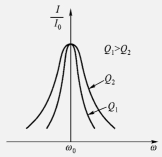
>6. **广义失谐**
>$\delta=Q(\frac{\omega}{\omega_0}\!-\!\frac{\omega_0}{\omega})$
>$\omega约等于\omega_0时，\delta=Q\frac{2\Delta\omega}{\omega_0}=Q\frac{2\Delta f}{f_0}$
>7. **求解通频带用广义谐振** 求得$2\Delta\omega_{0.7}=\frac{\omega_0}{Q}$
>8. **相移** $\psi=-arctanQ\cdot(\frac{\omega}{\omega_0}-\frac{\omega_0}{\omega})$
>9. 能量关系
>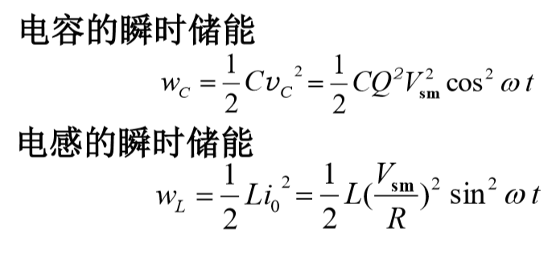
>$W_c=W_l$
>$Q=2\pi\frac{回路储能}{每周期能耗}$
>10. **负载影响和内阻影响**
>$Q_L=\frac{Q_0}{1+\frac{R_s}{R}+\frac{R_L}{R}}$
>然后用Q去计算其他的东西
### <w id=22>2.2并联谐振回路
#### 一般时高Q的计算
>1. **导纳**
>    * $Y=G+jB=\frac{CR}{L}+j(\omega C-\frac{1}{\omega L})$
>    * 低感高容
>    * 谐振时阻抗最大
>2. **Q**:$Q_p=\frac{\omega_pL}{R}=R_p\omega_pC$其中$R_p=\frac{1}{G}$
>    * $\dot I_{c_p}=jQ_p\dot I_s $
>    * $\dot I_{L_p}=-jQ_p\dot I_s $
>3. $\dot N(\omega)=\frac {R}{R+j(\omega C-\frac{1}{\omega L})}=\frac 1{1+jQ_p(\frac{\omega}{\omega_p}-\frac{\omega_p}{\omega})}$
>4. $Q_L=\frac{Q_p}{1+\frac{R_p}{R_s}+\frac{R_p}{R_L}}$

### <w id=23>2.3串并联谐振回路等效互换和抽头时的阻抗变换
#### 等效互换
>1. **如图所示可以推出来**
>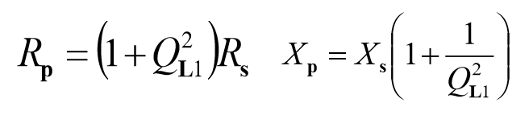
#### 抽头式并联电路的阻抗变换
>2. **自耦合变压器**
>   * 由低抽头向高抽头转换时，等效阻抗提高$\frac{1}{p^2}$
>   * 由高抽头向低转换时，等效阻抗提高${p^2}$
### <w id=32>3.2晶体管高频小信号等效电路与参数
#### 形式等效电路(网络参数等效电路)
>1. **把晶体管看成二端口网络**
>$\dot I_1=y_i \dot V_1+y_r \dot V_2$
>$\dot I_2=y_f \dot V_1+y_o \dot V_2$
>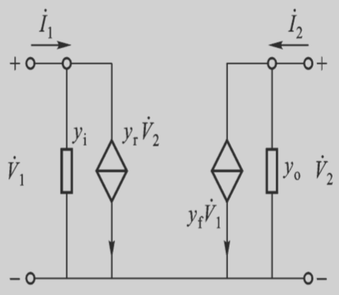
>三极管的形式等效电路
>
>$y_i$**：输入导纳**
>$y_r$**：反向传输导纳**return
>$y_f$**：正向传输导纳**front
>$y_o$**：输出导纳**
>
#### 混合$\pi$等效电路
>1. **等效电路图**
>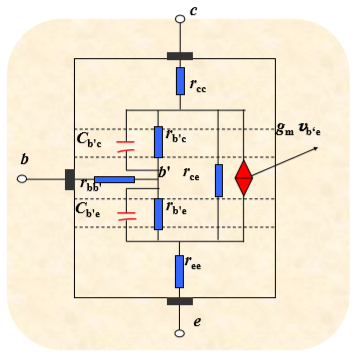
>各个元件宽频范围内都保持常数
>分析计算的时候很不方便
>2. **计算电路模型**
>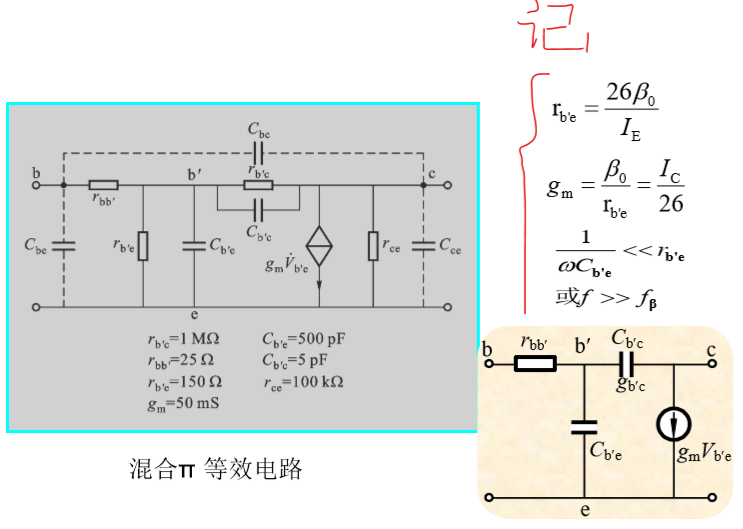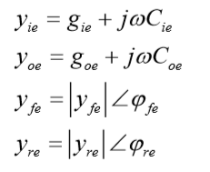
#### 晶体管高频参数
>1. 截止频率：$\dot \beta=\frac{\beta_0}{1+j\frac{f}{f_\beta}}下降到\frac{1}{\sqrt{2}}\beta的频率$
>2. 特征频率：$\beta=1$
>3. 最高工作频率$f_{max},功率增益G_p=1的时候$
>1. 截止频率
### <w id=33>3.3单调谐回路谐振放大器
####形式等效电路(网络参数等效电路)
>1. **单调谐：并联电路做负载**
>2. **静态分析**：电阻分压稳定电路
>3. **动态分析**：
>    1. 画交流等效电路
>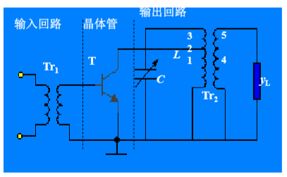
>       * 大电容短路
>       * 大电感短路
>       * 直流电源接地
>    2. 画交流小信号等效电路
>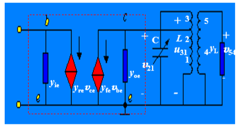
>    3. 假定无反馈
>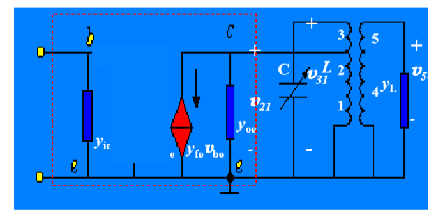
>三极管没有电感的
>
>$y_{ie}=g_{ie1}+j\omega C_{ie1}$**三极管输入端输入导纳**
>$y_{oe}=g_{oe1}+j\omega C_{oe1}$**三极管输出端输出导纳**
>$Y_L=g_{ie2}+j\omega C_{ie2}$**电感输入端的输入导纳**
>
#### 电压增益
>1. **把晶体管集电极回路和负载 折合到振荡回路两端**
>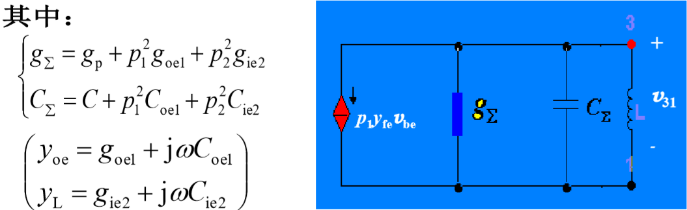
>受控源$y_{fe}V_{be}$的fe是此时频率，由于变压器变成$p_1$倍不过分
>$A_v=\frac{u_o}{u_i}=\frac{u_5}{u_i}=\frac{p_2u_{31}}{u_{be}}$
>2. **求出$u_{31}$即可求出$A_u$**
>3. $u_{31}=-\frac{p_1y_{fe}y_{be}}{g_{\sum}+j\omega C_{\sum}+\frac{1}{j\omega L}}$**电流除以电导嘛就是**
>4. $A_v=\frac{u_o}{u_i}=\frac{u_5}{u_i}=\frac{p_2u_{31}}{u_{be}}=-\frac{p_1p_2y_{be}}{g_{\sum}+j\omega C_{\sum}+\frac{1}{j\omega L}}=-\frac{p_1p_2y_{be}}{g_{\sum}(1+jQ_L\frac{2\Delta f}{f_0})}$**有一个广义失谐的代换**
>
>
>
>
>